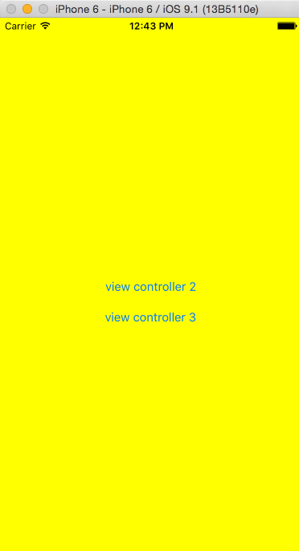

Using mutiple Storyboard instances in one app
=============
Recently, I worked on a project that have a massive Storyboard with so many view controllers, that my Xcode becomes so sluggish whenever I open that main Storyboard file.

That's when I decided to break those view controllers into their own Storyboard.

And it is quite a simple thing to do, require a little bit of setup, but you Xcode will run faster, cleaner, and you can quickly check the view controller UI easily.

I know iOS 9  now support [Storyboard References](https://developer.apple.com/library/prerelease/ios/recipes/xcode_help-IB_storyboard/Chapters/AddSBReference.html), but if you want your app to be compatible with iOS 8, you can use this trick.

## Example project:
You can download the project at this github url: https://github.com/heroddaji/blog_multiple_storyboard

There are 3 UIViewController, each of them is manage by their own Storyboard,
you can click on the buttons to see the other view controller (loaded from different Storyboard)




## How to do it:
> **Step 1**: You need to define the Storyboard ID for each UIViewController you wanna load from. You can set it up by looking at the Identity section in Identity Inspector.


In the example, each ViewControler get the Identity of their class name.

> **Step 2**: If you have only one UIViewControler in a Storyboard, you can set it to become the initial view controller in the Attributes Inspector

In the example, ViewControler3 is the initial View Controller of the Storyboard3, while ViewControler2 is not the initial view Controller of the Storyboard2


> **Step 3**: Finally, you can use this code to load the view controller based on the Storyboard name. What this code does is that this Utility class will load and return a UIViewControler instance based on Storyboard name and ViewControler ID you set in the **Step 1**. If the ViewControler name is nil, it will load the inital view controller that is set in that storyboard.

```Swift
import UIKit

class Utility: NSObject {

    class func loadViewFrom(storyboardId:String, viewControllerId:String? = nil) -> UIViewController {
        let sb = UIStoryboard(name: storyboardId, bundle: nil)
        var vc:UIViewController!

        if viewControllerId == nil {
            vc = sb.instantiateInitialViewController()
        }else{
            vc = sb.instantiateViewControllerWithIdentifier(viewControllerId!)
        }

        return vc
    }
}
```

That is, happy coding guys and gals, don't forget to check out the [github example](https://github.com/heroddaji/blog_multiple_storyboard
).

If you have any question, let's me know in the comment.
