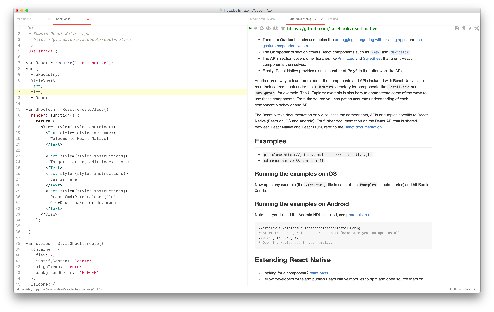

Good/best approach for using IDE/Editor to practice React Native
==
[React Native](http://www.reactnative.com/) is awesome, it allows you to code in javascript, and deliver native app deployment for both Android and iOS.

As I never learn javascript before, I am trying to practice it bit by bit by going through good tutorials online, etc.. But I really hate to code a bit, then look at the website, then go back and code, and since I have two monitors, you may think that will help, but still I don't like to keep switching my neck, haha.

So to start with coding in javascript, I also learn to use the awesome [Atom text editor](https://atom.io/packages), you should definitively use it, it is just so awesome.

And the trick I use to have more focus, less switching head is to have 2 open panes in Atom, one for writing code, one for **viewing the tutorial directly in side Atom**, using the also very awesom [Browser-plus plugin](https://atom.io/packages/browser-plus)

that's it, happy coding and practice ReactNative gals and guys
