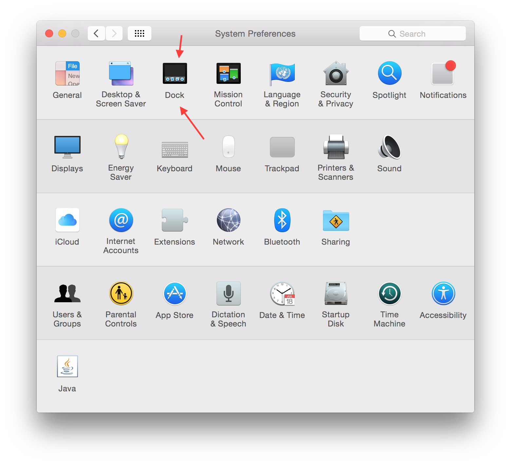
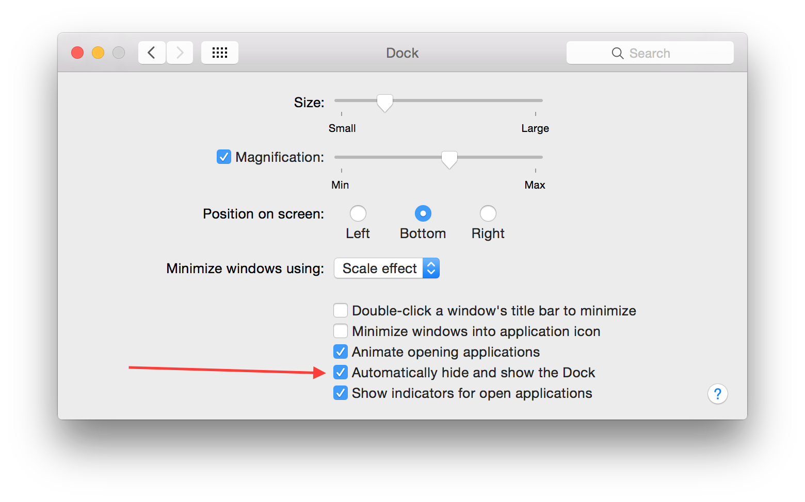

Make MacOS dock display in 2 monitors
===
so I recently has a new monitor, yay 😄
but when you hook up your new monitor with your macbook as a 2nd monitor,
the MacOS dock goes crazy...😠

Sometime it randomly jumps to other monitor without asking me first, hmmmm 🐷

Another problem is that sometime I want to use the dock in current monitor where my mouse cursor is , but then I have to move back to my main monitor just to use it, suckkkkk

But quickly, i found a simple solution on the internet (Sorry I forget the source 😞)

> The simple trick is enable the setting "Automatically hide and show the Dock" option in Setting app -> Dock section

Now whenever you move your cursor to the bottom of either screen, the dock will display right there, like magic!!!! 😆

That's it gals and guys, happy docking!
