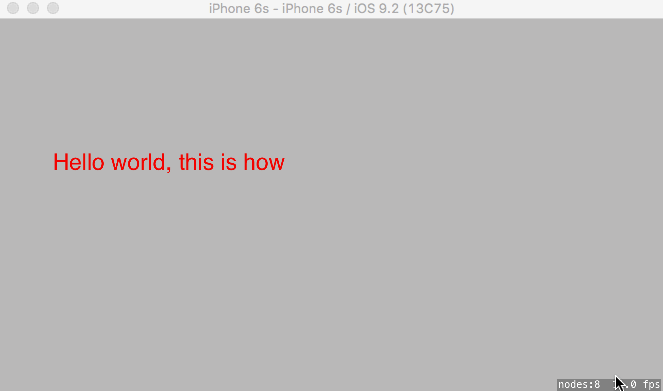

Having a running Label text effect display in SpriteKit, Swift
==
I just submited my first app ever to the Apple AppStore, yayyy. It is a silly interactive cute elephant game for kids, using SpriteKit.

The one challenge I had was to have a story text appear slowly (running) on the scene. Using SKAction with delay does not really work. Finally, I came up with a solution where I have to update the text in each render frame.  Also I want to have text appears with multiple lines, thus I make a Node class, and add text label as child nodes on each frame, and it works fine for me.

You can check the class in the gist, with the DKRunningLabelNode.swift class, and how to use it in GameScene.swift class
and also download my sample application for this. Enjoy coding guys and gals

https://gist.github.com/heroddaji/f57788424f96c155db7d.js

